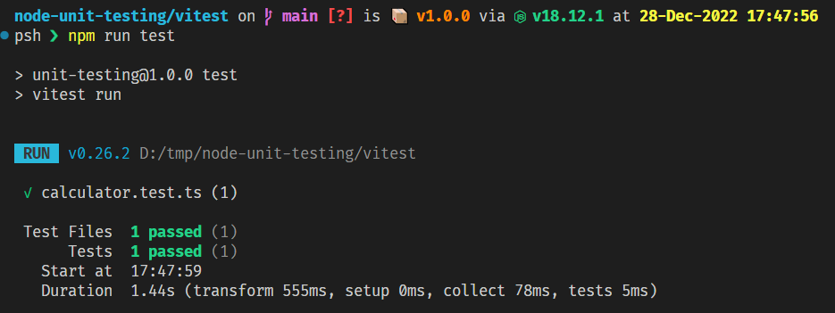
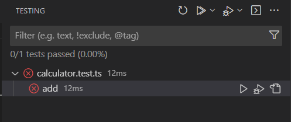
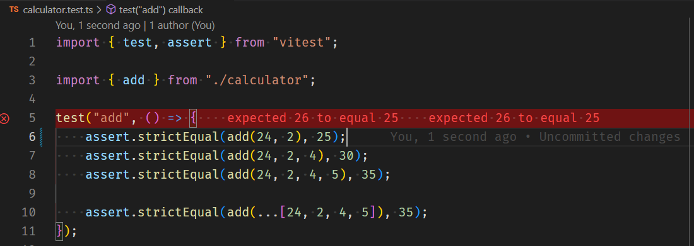

# NodeJS Unit testing setup

Example setup for unit testing with various test frameworks.

# Vitest

[vitest](./vitest)

Vitest has support for the vscode test runner.

https://marketplace.visualstudio.com/items?itemName=ZixuanChen.vitest-explorer

# Jest

[jest](./jest)

Jest has support for the vscode test runner.

https://marketplace.visualstudio.com/items?itemName=Orta.vscode-jest

# Mocha

[mocha](./mocha)

# Native NodeJS 18 test runner
[native-node-18](./native-node-18)

